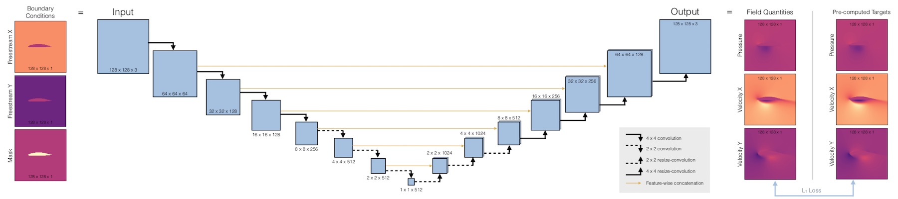

# Deep_Flow_Prediction
 Fluid flow (Reynolds-averaged Navier Stokes) predictions with deep learning.
 
Pytorch Implementation of the paper ["Deep learning methods for Reynolds-averaged Navier-Stokes simulations of airfoil flows"](https://arxiv.org/abs/1810.08217)

## Required software

This codebase requires _PyTorch_ and _numpy_ for the deep learning part,
and _openfoam_ and _gmsh_ for data generation and meshing (you don't need the latter 
two if you download the pre-computed training data below). 
To install these under Ubuntu run, use e.g.: 
```
sudo apt-get update
sudo pip install torch numpy


sudo sh -c "wget -O - https://dl.openfoam.org/gpg.key | apt-key add -"
sudo add-apt-repository http://dl.openfoam.org/ubuntu
sudo apt-get -y install openfoam8 gmsh
```
(Details can be found on the installation pages of [PyTorch](https://pytorch.org/get-started/locally/) and 
[OpenFOAM](https://openfoam.org/download/8-ubuntu/).)


## Input Data


An example UIUC database entry with the corresponding simulation mesh. The region around the airfoil considered for CNN inference is highlighted with a red square.

Each Ground Truth triple contains Pressure, X, and Y components of the Velocity. Each component and data set is normalized independently for visualization, thus these images show the structure of the solutions rather than the range of values across different solutions.

## Data generation

Note that you can skip the next two steps if you download the training
data packages below. Simply make sure you have `data/train` and `data/test`
in the source directory, then you can continue with the training step.

### Download airfoils

First, enter the `data` directory. 
Download the airfoil profiles by running `./download_airfoils.sh`, this
will create `airfoil_database` and `airfoil_database_test` directories.
(The latter contains a subset that shouldn't be used for training.) The
airfoild database should contain 1498 files afterwards.

### Generate data

Now run `python ./dataGen.py` to generate a first set of 100 airfoils.
This script executes _openfoam_ and runs _gmsh_ for meshing the airfoil profiles. 

Once `dataGen.py` has finished, you should find 100 .npz files in a new
directory called `train`. You can call this script repeatedly to generate 
more data, or adjust
the `samples` variables to generate more samples with a single call. 
For a first test, 100 samples are sufficient, for higher quality models, more
than 10k are recommended..

Output files are saved as compressed numpy arrays. The tensor size in each
sample file is 6x128x128 with dimensions: channels, x, y. 
The first three channels represent the input,
consisting (in this order) of two fields corresponding to the freestream velocities in x and y
direction and one field containing a mask of the airfoil geometry as 
a mask. The last three channels represent the target, containing one pressure and two velocity
fields.

## Dataset

Below you can download a large-scale training data set, and the test data set used in the accompanying paper:

* Reduced data set with 6.4k samples plus test data (1.2GB): <https://dataserv.ub.tum.de/s/m1470791/download?path=%2F&files=data_6k.tar.gz>
  (or via mediaTUM <https://dataserv.ub.tum.de/index.php/s/m1470791>)
* Full data set with 53.8k samples plus test data (10GB): <https://dataserv.ub.tum.de/s/m1459172/download?path=%2F&files=data_full.tar.gz>
  (or via mediaTUM <https://dataserv.ub.tum.de/index.php/s/m1459172>)


## Training



The U-net architecture receives three constant fields as input, each containing the airfoil shape. The black arrows denote convolutional layers, while orange arrows indicate skip connections. The inferred outputs have exactly the same size as the inputs, and are compared to the targets with an L1 loss. The target data sets on the right are pre-computed with OpenFOAM.

```bash
python run.py --num_epochs=1 --batch_size=10 
```


## Summary

Based on this framework, you should be able to train deep learning models that yield relative errors of 2-3% for the RANS data sets.

## Reference

Original codebase [Deep-Flow-Prediction](https://github.com/thunil/Deep-Flow-Prediction)

Bilinear Upsample (https://discuss.pytorch.org/t/what-we-should-use-align-corners-false/22663/9)


## Acknowledgements

Authors:
*N. Thuerey, K. Weissenow, L. Prantl, Xiangyu Hu*

```
@article{thuerey2020deepFlowPred,
  title={Deep learning methods for Reynolds-averaged Navier--Stokes simulations of airfoil flows},
  author={Thuerey, Nils and Wei{\ss}enow, Konstantin and Prantl, Lukas and Hu, Xiangyu},
  journal={AIAA Journal}, year={2020},
  volume={58}, number={1}, pages={25--36},
  publisher={American Institute of Aeronautics and Astronautics}
}
```
